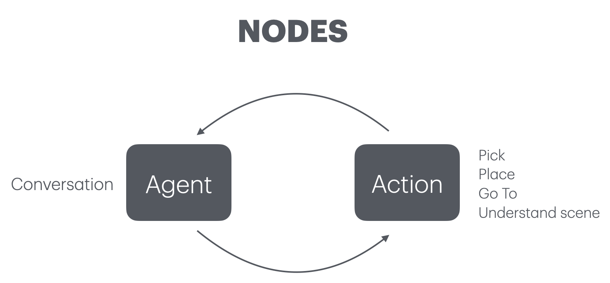

# Eurobin-Coopetition: TEAM EGO
This repo shares the code used on Alter Ego during Eurobin's 1st coopetition held in Nancy, France. \
Check the rules [HERE](https://www.eurobin-project.eu/images/2024/euROBIN_Nancy_Coopetition_RuleBook.pdf).

## 1) Object Detector
Module for object recognition based on YOLO11

## 2) Speech 2 Text
Whisper module running locally. 

## 3) Autonomous Agent
Module that enables autonomous behaviours, the robot is free to perform basic actions.

    

